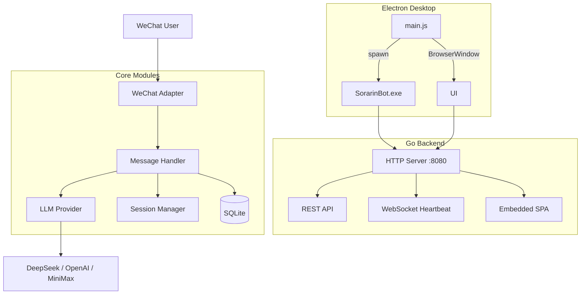
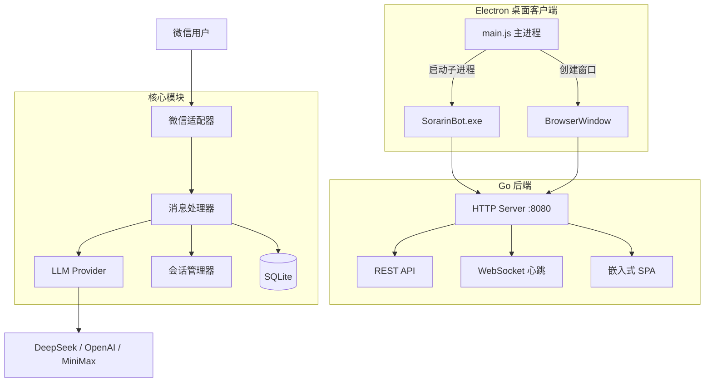

<div align="center">


# SorarinBot

**微信 AI 智能助手 · WeChat AI Assistant Powered by LLM**

[](https://github.com/SorarinX/SorarinBot/releases)
[](LICENSE)
[](mailto:zyc2597376118@gmail.com)
[](https://go.dev/)
[](https://www.electronjs.org/)
[](https://vuejs.org/)
[](https://nuxt.com/)
[](#platform-support)

[**English**](#english) · [**中文**](#中文)

</div>

---

<a id="english"></a>

## ✨ Features

| Feature | Description |
|---------|-------------|
| 🤖 **Multi-Model** | DeepSeek, MiniMax, OpenAI, Claude, Gemini, Ollama — any OpenAI-compatible API |
| 💬 **Smart Chat** | Private auto-reply, group @mention trigger, configurable context memory |
| 🖼️ **Vision** | Send an image + text to invoke Vision models for visual Q&A |
| 🎯 **Pat-Pat** | Random cat-girl replies on WeChat "pat-pat" interactions |
| 🖥️ **Desktop App** | Electron wrapper — Windows + **Linux** support, one-click launch, auto-exit on window close |
| 📊 **Dashboard** | Real-time session monitor, chat history, system logs, live config editing |
| ⚙️ **Hot Reload** | Change API key, model, or system prompt via Web UI — no restart needed |
| 🌙 **Dark Mode** | Light/dark theme toggle with responsive layout |

## 📸 Screenshots

> 🔗 **[Live Preview](https://sorarinx.github.io/SorarinBot/)** — Try the dashboard with simulated data

| Dashboard | Chat History |
|:---------:|:----------:|
|  |  |

| System Logs | Settings |
|:---------:|:----------:|
|  |  |

## 🚀 Quick Start

### Windows

Grab `SorarinBot Setup 2.2.0.exe` from [Releases](https://github.com/SorarinX/SorarinBot/releases) and run it.

### Linux

Download `sorarinbot-v2.2.0-linux-amd64.tar.gz` from [Releases](https://github.com/SorarinX/SorarinBot/releases):

```bash
# 1. Download and extract
mkdir -p ~/SorarinBot && cd ~/SorarinBot
curl -L -o sorarinbot.tar.gz \
  https://github.com/SorarinX/SorarinBot/releases/download/v2.2.0/sorarinbot-v2.2.0-linux-amd64.tar.gz
tar -xzf sorarinbot.tar.gz --strip-components=1
rm sorarinbot.tar.gz

# 2. Configure — edit config.yaml, set your API key
nano config.yaml

# 3. Run
chmod +x SorarinBot
./SorarinBot
```

Then open **http://localhost:8080** in your browser.

> 📖 Full tutorial with FAQ: [linux/TUTORIAL.md](linux/TUTORIAL.md)

### Build from Source

```bash
git clone https://github.com/SorarinX/SorarinBot.git && cd SorarinBot

# Backend (Windows)
go build -o SorarinBot.exe .

# Backend (Linux)
GOOS=linux GOARCH=amd64 go build -o SorarinBot .

# Frontend
cd web && pnpm install && pnpm build && cd ..

# Electron client (Windows)
cd electron && npm install && npx electron-builder --win && cd ..

# Electron client (Linux) — see linux/README.md
cd linux/src && bash scripts/build.sh
```

## 🖥️ Platform Support

| Platform | Status | Package | Notes |
|----------|--------|---------|-------|
| **Windows** | ✅ Stable | NSIS installer (.exe) | Desktop use |
| **Linux** | ✅ Available | tar.gz (7MB, zero dependencies) | Desktop & **server** deployment |
| **macOS** | 🔜 Planned | - | Community contributions welcome |

> **v2.2.0 新增 Linux 桌面端支持！** 详见 [linux/](linux/) 目录。

## ⚙️ Configuration

Edit `config.yaml` after first launch:

```yaml
provider:
  name: openaicompat
  base_url: https://api.deepseek.com
  model: deepseek-chat
  api_key: YOUR_API_KEY

prompt: "You are a helpful AI assistant."

chat:
  context_enabled: true
  max_context: 3
```

Environment variable fallback: `MINIMAX_API_KEY`, `DEEPSEEK_API_KEY`, `OPENAI_API_KEY`

## 🏗️ Architecture



## 📖 From Web to Desktop: The Electron Journey

<details>
<summary><strong>Click to expand the full story</strong></summary>

### Why Electron?

SorarinBot started as a Go HTTP server with an embedded Nuxt 4 SPA. Users accessed it via `localhost:8080` in their browser. This worked for development, but real-world usage revealed three problems:

1. **Browser dependency** — Users had to manually open a browser. Closing the tab killed the UI while the backend kept running silently.
2. **Console window** — The Go binary spawned a visible terminal. Hiding it via `ShowWindow(SW_HIDE)` was fragile and confused non-technical users.
3. **Distribution** — Shipping a Go binary + config + database required manual setup scripts.

We chose Electron over Tauri because our Nuxt SPA runs unchanged in Chromium (zero frontend modifications), and `electron-builder` provides turnkey NSIS packaging. Tauri would require adding Rust to our build pipeline.

### Architecture

```
v1.x (Web)                     v2.x (Electron)
─────────────                   ────────────────
Browser                         Electron Shell (main.js)
  → Go HTTP Server                → spawn Go subprocess
    → Embedded SPA                  → BrowserWindow → localhost:8080
    → REST API + WebSocket          → System Tray
    → WeChat + LLM                  → IPC bridge (preload.js)
                                  Go Backend (extraResource)
                                    → HTTP Server
                                    → Embedded SPA
                                    → WeChat + LLM
```

The frontend code is **100% reused**. Electron's `BrowserWindow` loads the Go server's HTTP address directly.

### What We Learned

| Phase | Challenge | Solution |
|-------|-----------|----------|
| Shell | Go server boot latency | `waitForServer()` polls localhost:8080 every 500ms |
| Build | Go `embed` ignores `_` prefix | Vite chunk naming workaround (`c[hash].js`) |
| Build | `cmd.exe /c start` can't find exe | Use full path `spawn(exePath)` |
| Build | `config.yaml` missing in installer | Add as `extraResource` |
| Build | `dist/` contaminated with web files | Clean dist before electron-builder |
| Runtime | Program Files write permission | Fallback to `%APPDATA%/SorarinBot` |
| Runtime | White screen on first launch | Include empty `config.yaml` template |
| Runtime | System tray clicks not responding | Move registry writes to goroutine |
| Packaging | `electronDist` points to wrong dir | Use local electron zip with `electronDist: "dist"` |

### v2.x Feature Timeline

| Version | Features |
|---------|----------|
| v2.0.0 | Electron shell, NSIS installer, WebSocket heartbeat |
| v2.1.0 | Bug fixes (provider race, nil panic, image cache), PolyForm NC license, bilingual README |
| v2.2.0 | System tray (Chinese menu), auto-start via registry, settings UI toggle, Linux port |

### Current State (v2.2.0)

| Platform | Status | Package | Size |
|----------|--------|---------|------|
| Windows | ✅ Stable | NSIS installer | 106 MB |
| Linux | ✅ Available | tar.gz | 7 MB |
| macOS | 🔜 Planned | - | - |

### Known Limitations

- **Package size** — Electron runtime (~90 MB) dominates. Exploring Tauri v2 migration (~30 MB target).
- **Auto-update** — Not yet implemented. Users must manually download new versions.
- **Windows-only system tray** — Linux tray requires `libappindicator`. Auto-start on Linux not yet implemented.

</details>

## 📡 API Reference

| Endpoint | Method | Description |
|----------|--------|-------------|
| `/api/status` | GET | System status (uptime, provider, model) |
| `/api/sessions` | GET | Active session list |
| `/api/session?user=X` | GET | Session detail for a user |
| `/api/history?limit=50&offset=0` | GET | Paginated chat history |
| `/api/logs?limit=100` | GET | System logs |
| `/api/config` | GET/PUT | Read or update configuration |
| `/api/test` | POST | Test provider connection |
| `/api/models` | GET | List available models |
| `/ws` | WebSocket | Browser heartbeat |

## 🛠️ Development

```bash
# Go backend
go mod tidy && go run .

# Frontend (dev server with proxy to :8080)
cd web && pnpm install && pnpm dev

# Electron (requires Go backend running)
cd electron && npm install && npm start
```

**Debugging:**
- Main process: `console.log` → terminal
- Renderer: set `mainWindow.webContents.openDevTools()` in `main.js`
- Go backend: `SORARINBOT_DEBUG=1` environment variable

## 🤝 Contributing

Issues and pull requests are welcome. Please read [CONTRIBUTING.md](CONTRIBUTING.md) before submitting.

## 📄 License

This project is licensed under the [PolyForm Noncommercial License 1.0.0](LICENSE).

- **Noncommercial use** — Free (personal, education, research, charity, government)
- **Commercial use** — Requires a separate license. Contact: **zyc2597376118@gmail.com**

See [LICENSE](LICENSE) for full terms.

## 🙏 Acknowledgements

- [openwechat](https://github.com/eatmoreapple/openwechat) — WeChat Web Protocol
- [Nuxt UI](https://ui.nuxt.com) — UI Component Library
- [electron-builder](https://www.electron.build) — Electron Packaging

## ☕ Support

If you find SorarinBot useful, consider buying the author a coffee!

<div align="center">

[](https://afdian.com/a/sorarinbot)


<br>
<sub>WeChat Pay / 微信支付</sub>
</div>

---

<a id="中文"></a>

## ✨ 功能特性

| 特性 | 说明 |
|------|------|
| 🤖 **多模型支持** | DeepSeek、MiniMax、OpenAI、Claude、Gemini、Ollama — 兼容所有 OpenAI API 格式 |
| 💬 **智能对话** | 私聊自动回复，群聊 @触发，可配置上下文记忆轮数 |
| 🖼️ **图片识别** | 发送图片 + 文字，调用 Vision 模型进行视觉问答 |
| 🎯 **拍一拍互动** | 微信拍一拍随机猫娘回复 |
| 🖥️ **桌面客户端** | Electron 封装，支持 Windows + **Linux**，一键启动，关闭窗口自动退出 |
| 📊 **管理后台** | 实时监控会话、查看聊天记录、系统日志、在线修改配置 |
| ⚙️ **热更新** | 通过 Web UI 修改 API Key、模型、提示词，即时生效无需重启 |
| 🌙 **暗色模式** | 支持明暗主题切换，响应式布局 |

## 📸 界面预览

> 🔗 **[在线预览](https://sorarinx.github.io/SorarinBot/)** — 使用模拟数据体验完整界面

| 仪表盘 | 聊天记录 |
|:------:|:------:|
|  |  |

| 系统日志 | 配置管理 |
|:------:|:------:|
|  |  |

| 系统提示词 |
|:--------:|
|  |

## 🚀 快速开始

### Windows

从 [Releases](https://github.com/SorarinX/SorarinBot/releases) 下载 `SorarinBot Setup 2.2.0.exe`，双击安装即可。

### Linux

从 [Releases](https://github.com/SorarinX/SorarinBot/releases) 下载 `sorarinbot-v2.2.0-linux-amd64.tar.gz`：

```bash
# 1. 下载解压
mkdir -p ~/SorarinBot && cd ~/SorarinBot
curl -L -o sorarinbot.tar.gz \
  https://github.com/SorarinX/SorarinBot/releases/download/v2.2.0/sorarinbot-v2.2.0-linux-amd64.tar.gz
tar -xzf sorarinbot.tar.gz --strip-components=1
rm sorarinbot.tar.gz

# 2. 编辑配置文件，填入 API Key
nano config.yaml

# 3. 启动
chmod +x SorarinBot
./SorarinBot
```

然后在浏览器打开 **http://localhost:8080**。

# 4. 启动
cd ~/SorarinBot
./SorarinBot
```

然后在浏览器打开 **http://localhost:8080**。

> 📖 完整教程（含常见问题）：[linux/TUTORIAL.md](linux/TUTORIAL.md)

### 从源码构建

```bash
git clone https://github.com/SorarinX/SorarinBot.git && cd SorarinBot

# 构建 Go 后端（Windows）
go build -o SorarinBot.exe .

# 构建 Go 后端（Linux）
GOOS=linux GOARCH=amd64 go build -o SorarinBot .

# 构建前端
cd web && pnpm install && pnpm build && cd ..

# 构建 Electron 客户端（Windows）
cd electron && npm install && npx electron-builder --win && cd ..

# 构建 Electron 客户端（Linux）— 详见 linux/README.md
cd linux/src && bash scripts/build.sh
```

## ⚙️ 配置说明

首次运行后编辑 `config.yaml`：

```yaml
provider:
  name: openaicompat        # openaicompat / minimax / deepseek / openai
  base_url: https://api.deepseek.com
  model: deepseek-chat
  api_key: YOUR_API_KEY     # 替换为你的 API Key

prompt: "你是一个有用的 AI 助手。"

chat:
  context_enabled: true     # 启用上下文记忆
  max_context: 3            # 最大上下文轮数
```

环境变量兜底：`MINIMAX_API_KEY`、`DEEPSEEK_API_KEY`、`OPENAI_API_KEY`

## 🏗️ 项目架构

```
SorarinBot/
├── main.go                    # Go 后端入口
├── heartbeat.go               # 浏览器心跳检测
├── platform_windows.go        # Windows 控制台管理
├── core/
│   ├── config/                # 配置管理（YAML 读写、热更新）
│   ├── message/               # 消息处理（LLM 调用、图片缓存）
│   └── session/               # 会话管理（上下文窗口）
├── providers/
│   └── openaicompat/          # OpenAI 兼容 API 客户端
├── adapters/
│   └── openwechat/            # 微信消息适配器
├── internal/
│   └── openwechat/            # 微信 Web 协议（fork）
├── database/                  # SQLite 数据库层
├── web/                       # Nuxt 4 前端（SPA，嵌入 Go 二进制）
│   ├── app/                   # Vue 源码
│   └── dist/                  # 构建产物（go:embed）
├── electron/                  # Electron 桌面客户端（Windows）
│   ├── main.js                # 主进程
│   ├── preload.js             # 预加载脚本
│   └── package.json           # 构建配置
├── linux/                     # Linux 桌面端（v2.2.0 新增）
│   ├── platform_linux.go      # 平台适配
│   ├── electron/              # Linux Electron 配置
│   └── scripts/               # 构建脚本
└── logo.png                   # 项目 Logo
```



## 📖 从 Web 到 Electron 的演进之路

<details>
<summary><strong>展开阅读完整的故事</strong></summary>

### 为什么选择 Electron？

SorarinBot 最初是一个 Go HTTP 服务器 + Nuxt 4 SPA 前端，用户通过浏览器访问 `localhost:8080` 管理微信机器人。开发阶段没问题，但实际使用暴露了三个痛点：

1. **浏览器依赖** — 用户必须手动打开浏览器。误关标签后后台仍在运行，但失去了管理入口。
2. **控制台窗口** — Go 二进制弹出黑色终端。用 `ShowWindow(SW_HIDE)` 隐藏太 hack，非技术用户会困惑。
3. **分发困难** — Go 二进制 + 配置 + 数据库打包成"桌面应用"需要额外脚本和文档。

选择 Electron 而非 Tauri 的原因：Nuxt SPA 在 Chromium 中零改动即可运行，`electron-builder` 开箱即用的 NSIS 打包。Tauri 需要引入 Rust 工具链。

### 架构演变

```
v1.x（Web 版）                  v2.x（Electron 版）
─────────────                   ────────────────
浏览器                          Electron 壳 (main.js)
  → Go HTTP 服务器                 → 启动 Go 子进程
    → 嵌入式 SPA                    → BrowserWindow → localhost:8080
    → REST API + WebSocket          → 系统托盘
    → 微信 + LLM                    → IPC 桥接 (preload.js)
                                  Go 后端 (extraResource)
                                    → HTTP 服务器
                                    → 嵌入式 SPA
                                    → 微信 + LLM
```

前端代码 **100% 复用**。Electron 的 `BrowserWindow` 直接加载 Go 服务器的 HTTP 地址。

### 踩过的坑

| 阶段 | 问题 | 解决方案 |
|------|------|---------|
| 壳搭建 | Go 服务启动有延迟 | `waitForServer()` 每 500ms 轮询 |
| 构建 | Go `embed` 忽略 `_` 前缀 | Vite chunk 命名 workaround（`c[hash].js`） |
| 构建 | `cmd.exe /c start` 找不到 exe | 用完整路径 `spawn(exePath)` |
| 构建 | 安装包缺少 `config.yaml` | 作为 `extraResource` 打包 |
| 构建 | `dist/` 被 web 文件污染 | 构建前清理 dist |
| 运行 | Program Files 无写权限 | 回退到 `%APPDATA%/SorarinBot` |
| 运行 | 首次启动白屏 | 打包空 `config.yaml` 模板 |
| 运行 | 托盘点击无响应 | 注册表写入移到 goroutine |
| 打包 | `electronDist` 指向错误目录 | 用本地 electron zip + `electronDist: "dist"` |

### v2.x 版本历程

| 版本 | 功能 |
|------|------|
| v2.0.0 | Electron 壳、NSIS 安装包、WebSocket 心跳 |
| v2.1.0 | Bug 修复（Provider 竞态、nil panic、图片缓存）、PolyForm NC 许可证、双语 README |
| v2.2.0 | 系统托盘（中文菜单）、开机自启动（注册表）、设置页面开关、Linux 移植 |

### 当前状态（v2.2.0）

| 平台 | 状态 | 包格式 | 大小 |
|------|------|--------|------|
| Windows | ✅ 稳定 | NSIS 安装包 | 106 MB |
| Linux | ✅ 可用 | tar.gz | 7 MB |
| macOS | 🔜 计划中 | - | - |

### 已知限制

- **安装包体积** — Electron 运行时占 ~90 MB。正在探索 Tauri v2 迁移（目标 ~30 MB）
- **自动更新** — 尚未实现，用户需手动下载新版本
- **系统托盘仅限 Windows** — Linux 托盘需要 `libappindicator`，Linux 自启动尚未实现

</details>

## 📡 API 端点

| 端点 | 方法 | 说明 |
|------|------|------|
| `/api/status` | GET | 系统状态（uptime、provider、model） |
| `/api/sessions` | GET | 活跃会话列表 |
| `/api/session?user=X` | GET | 指定用户会话详情 |
| `/api/history?limit=50&offset=0` | GET | 分页查询聊天记录 |
| `/api/logs?limit=100` | GET | 系统日志 |
| `/api/config` | GET/PUT | 读取/更新配置 |
| `/api/test` | POST | 测试 Provider 连接 |
| `/api/models` | GET | 获取可用模型列表 |
| `/ws` | WebSocket | 浏览器心跳 |

## 🛠️ 开发指南

```bash
# Go 后端
go mod tidy && go run .

# 前端开发（自动代理到 :8080）
cd web && pnpm install && pnpm dev

# Electron 开发（需先启动 Go 后端）
cd electron && npm install && npm start
```

**调试技巧：**
- 主进程日志：`console.log` 输出到终端
- 渲染进程：在 `main.js` 中设置 `mainWindow.webContents.openDevTools()`
- Go 后端：设置环境变量 `SORARINBOT_DEBUG=1`

## 🤝 贡献

欢迎提交 Issue 和 Pull Request。请阅读 [CONTRIBUTING.md](CONTRIBUTING.md) 了解贡献指南。

## 📄 许可证

本项目基于 [PolyForm Noncommercial License 1.0.0](LICENSE) 授权。

- **非商业用途** — 免费（个人学习、教育研究、公益机构、政府部门）
- **商业用途** — 需取得书面商业授权。联系邮箱：**zyc2597376118@gmail.com**

完整条款详见 [LICENSE](LICENSE)。

## 🙏 致谢

- [openwechat](https://github.com/eatmoreapple/openwechat) — 微信 Web 协议
- [Nuxt UI](https://ui.nuxt.com) — UI 组件库
- [electron-builder](https://www.electron.build) — Electron 打包工具

## ☕ 打赏

如果你觉得 SorarinBot 有用，请作者喝杯咖啡！

<div align="center">

[](https://afdian.com/a/sorarinbot)
[](https://github.com/sponsors/SorarinX)


<br>
<sub>微信支付</sub>
</div>
