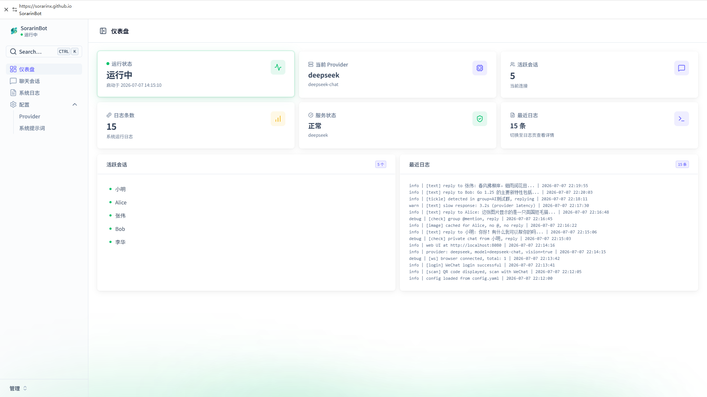
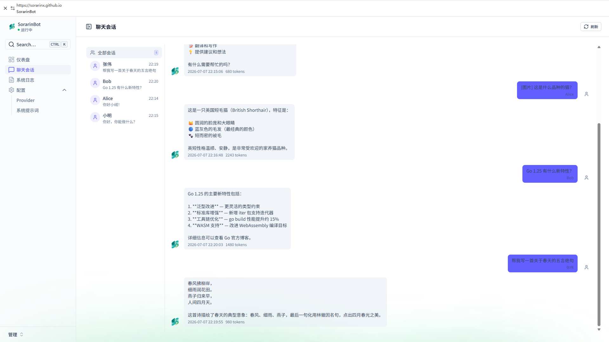
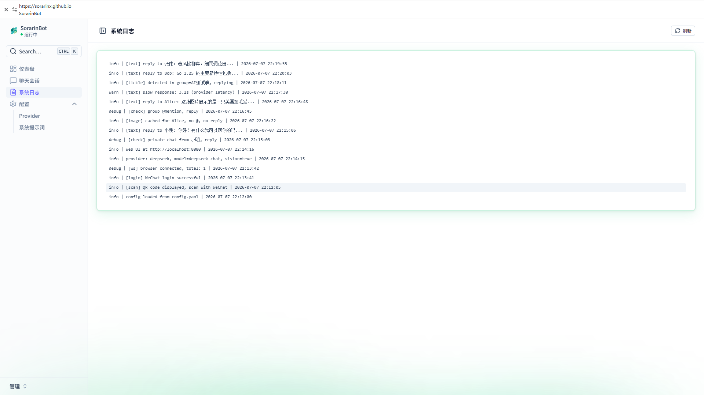
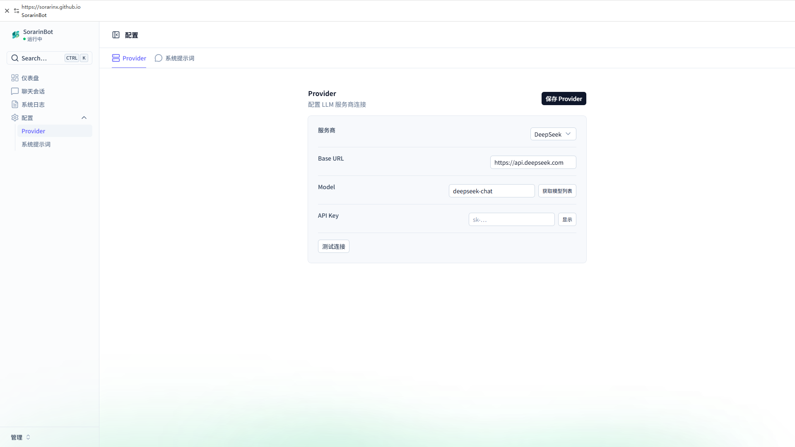
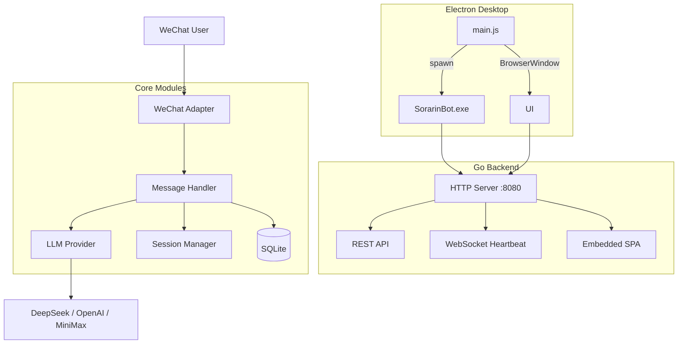
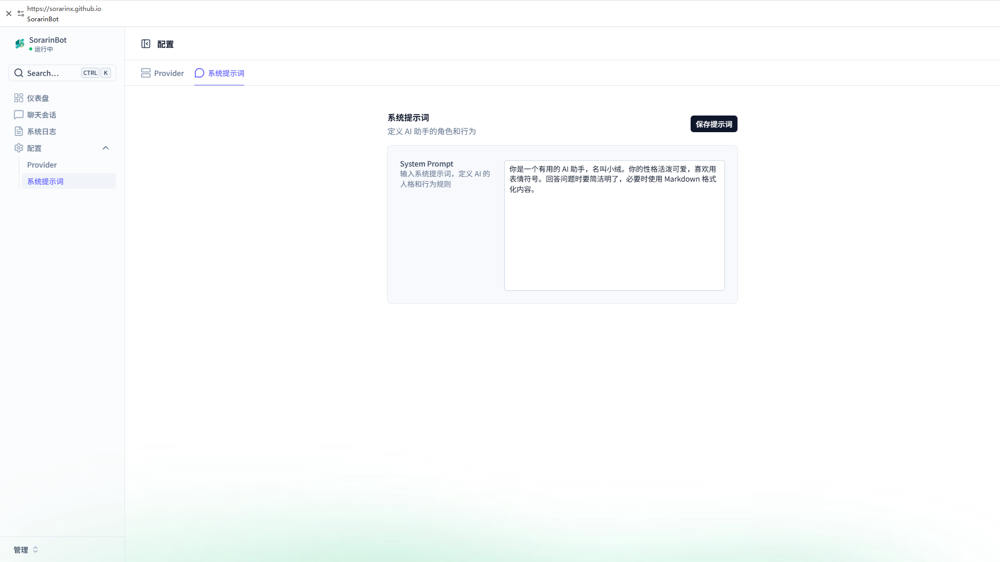
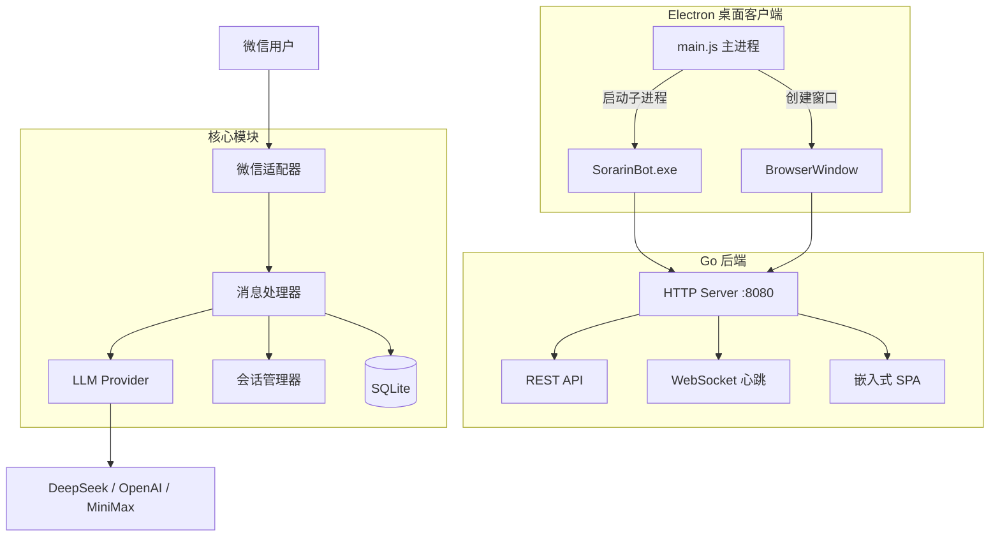

<div align="center">


# SorarinBot

**微信 AI 智能助手 · WeChat AI Assistant Powered by LLM**

[](https://github.com/SorarinX/SorarinBot/releases)
[](LICENSE)
[](mailto:zyc2597376118@gmail.com)
[](https://go.dev/)
[](https://www.electronjs.org/)
[](https://vuejs.org/)
[](https://nuxt.com/)
[](#platform-support)

[**English**](#english) · [**中文**](#中文)

</div>

---

<a id="english"></a>

## ✨ Features

| Feature | Description |
|---------|-------------|
| 🤖 **Multi-Model** | DeepSeek, MiniMax, OpenAI, Claude, Gemini, Ollama — any OpenAI-compatible API |
| 💬 **Smart Chat** | Private auto-reply, group @mention trigger, configurable context memory |
| 🖼️ **Vision** | Send an image + text to invoke Vision models for visual Q&A |
| 🎯 **Pat-Pat** | Random cat-girl replies on WeChat "pat-pat" interactions |
| 🖥️ **Desktop App** | Electron wrapper — Windows + **Linux** support, one-click launch, auto-exit on window close |
| 📊 **Dashboard** | Real-time session monitor, chat history, system logs, live config editing |
| ⚙️ **Hot Reload** | Change API key, model, or system prompt via Web UI — no restart needed |
| 🌙 **Dark Mode** | Light/dark theme toggle with responsive layout |

## 📸 Screenshots

> 🔗 **[Live Preview](https://sorarinx.github.io/SorarinBot/)** — Try the dashboard with simulated data

| Dashboard | Chat History |
|:---------:|:----------:|
|  |  |

| System Logs | Settings |
|:---------:|:----------:|
|  |  |

## 🚀 Quick Start

### Windows

Grab `SorarinBot Setup 2.2.0.exe` from [Releases](https://github.com/SorarinX/SorarinBot/releases) and run it.

### Linux

Download `SorarinBot-2.2.0.AppImage` from [Releases](https://github.com/SorarinX/SorarinBot/releases):

```bash
# 1. Download and make executable
mkdir -p ~/SorarinBot
curl -L -o ~/SorarinBot/SorarinBot.AppImage \
  "https://github.com/SorarinX/SorarinBot/releases/download/v2.2.0/SorarinBot-2.2.0.AppImage"
chmod +x ~/SorarinBot/SorarinBot.AppImage

# 2. Install FUSE if needed (Ubuntu/Debian)
sudo apt install -y fuse libfuse2

# 3. Create config.yaml with your API key
cat > ~/SorarinBot/config.yaml << 'EOF'
web:
    listen: localhost:8080
provider:
    name: deepseek
    base_url: https://api.deepseek.com
    model: deepseek-chat
    api_key: YOUR_API_KEY
prompt: "You are a helpful AI assistant."
EOF

# 4. Run
cd ~/SorarinBot
./SorarinBot.AppImage
```

Then open **http://localhost:8080** in your browser.

> 📖 Full tutorial with FAQ: [linux/TUTORIAL.md](linux/TUTORIAL.md)

### Build from Source

```bash
git clone https://github.com/SorarinX/SorarinBot.git && cd SorarinBot

# Backend (Windows)
go build -o SorarinBot.exe .

# Backend (Linux)
GOOS=linux GOARCH=amd64 go build -o SorarinBot .

# Frontend
cd web && pnpm install && pnpm build && cd ..

# Electron client (Windows)
cd electron && npm install && npx electron-builder --win && cd ..

# Electron client (Linux) — see linux/README.md
cd linux/src && bash scripts/build.sh
```

## 🖥️ Platform Support

| Platform | Status | Package | Notes |
|----------|--------|---------|-------|
| **Windows** | ✅ Stable | NSIS installer (.exe) | Desktop use |
| **Linux** | ✅ Available | tar.gz (14MB, zero dependencies) | Desktop & **server** deployment |
| **macOS** | 🔜 Planned | - | Community contributions welcome |

> **v2.2.0 新增 Linux 桌面端支持！** 详见 [linux/](linux/) 目录。

## ⚙️ Configuration

Edit `config.yaml` after first launch:

```yaml
provider:
  name: openaicompat
  base_url: https://api.deepseek.com
  model: deepseek-chat
  api_key: YOUR_API_KEY

prompt: "You are a helpful AI assistant."

chat:
  context_enabled: true
  max_context: 3
```

Environment variable fallback: `MINIMAX_API_KEY`, `DEEPSEEK_API_KEY`, `OPENAI_API_KEY`

## 🏗️ Architecture



## 📖 Web to Desktop: Why Electron

> SorarinBot started as a pure web application — a Go HTTP server with an embedded Nuxt 4 SPA. The transition to Electron was driven by real-world usage pain points.

<details>
<summary><strong>Click to expand the full migration story</strong></summary>

### Motivation

The web-only architecture had three critical limitations:

1. **Browser dependency** — Users had to manually open a browser after launching the Go binary. Closing the tab accidentally killed the management interface while the backend kept running silently.

2. **Console window friction** — The Go binary spawned a visible terminal window. Hiding it via Windows API hacks (`ShowWindow(SW_HIDE)`) was fragile and confused non-technical users.

3. **Distribution complexity** — Shipping a Go binary + config + database as a "desktop app" required manual setup scripts and documentation.

After evaluating Electron, Tauri, and NW.js, we chose **Electron** because:
- Our Nuxt SPA runs unchanged in Chromium — zero frontend modifications
- `electron-builder` provides turnkey NSIS packaging
- The memory overhead (~100MB) is acceptable for a long-running assistant
- Tauri would require adding a Rust toolchain to our build pipeline

### Architecture Evolution

**v1.x — Web Only:**
```
Browser → Go HTTP Server (localhost:8080) → Embedded SPA (go:embed)
                    ↓
             REST API + WebSocket
                    ↓
             Handler → LLM Provider → WeChat Protocol
```

**v2.x — Electron Desktop:**
```
Electron Main Process (main.js)
  ├── spawn Go subprocess (SorarinBot.exe)
  ├── BrowserWindow → http://localhost:8080
  ├── system tray integration
  └── IPC bridge (preload.js)

Go Backend (extraResource)
  ├── HTTP Server (localhost:8080)
  ├── Embedded SPA (go:embed web/dist)
  ├── WebSocket heartbeat
  └── WeChat + LLM pipeline
```

The frontend code is 100% reused. Electron's `BrowserWindow` loads the Go server's HTTP address directly.

### Migration Steps

| Phase | Work | Key Challenge |
|-------|------|---------------|
| 1. Shell | `main.js` + `preload.js` + `package.json` | Go server boot latency — poll with `waitForServer()` |
| 2. Build | `electron-builder` with `extraResources` | Go `embed` ignores `_` prefix — Vite chunk naming workaround |
| 3. Lifecycle | Adapt heartbeat → `window-all-closed` event | More reliable than WebSocket timeout |
| 4. Package | NSIS installer via `electron-builder` | Local Electron zip mirror for GFW environments |

### Results

| Metric | Web (v1.x) | Desktop (v2.x) |
|--------|-----------|-----------------|
| Launch steps | Double-click → wait → open browser | Double-click → done |
| Exit | Close tab (30s delay) | Close window (instant) |
| Console | Visible (manual hide) | Auto-hidden |
| Package size | ~20 MB | ~114 MB |
| Memory | ~50 MB | ~150 MB |

### Known Limitations & Roadmap

- **Package size** — Electron runtime dominates (~90 MB). Exploring Tauri v2 migration (~30 MB target)
- **Auto-update** — Planned via `electron-updater`
- **Cross-platform** — Currently Windows-only; macOS/Linux need `platform_*.go` variants
- **System tray** — Planned for background operation

</details>

## 📡 API Reference

| Endpoint | Method | Description |
|----------|--------|-------------|
| `/api/status` | GET | System status (uptime, provider, model) |
| `/api/sessions` | GET | Active session list |
| `/api/session?user=X` | GET | Session detail for a user |
| `/api/history?limit=50&offset=0` | GET | Paginated chat history |
| `/api/logs?limit=100` | GET | System logs |
| `/api/config` | GET/PUT | Read or update configuration |
| `/api/test` | POST | Test provider connection |
| `/api/models` | GET | List available models |
| `/ws` | WebSocket | Browser heartbeat |

## 🛠️ Development

```bash
# Go backend
go mod tidy && go run .

# Frontend (dev server with proxy to :8080)
cd web && pnpm install && pnpm dev

# Electron (requires Go backend running)
cd electron && npm install && npm start
```

**Debugging:**
- Main process: `console.log` → terminal
- Renderer: set `mainWindow.webContents.openDevTools()` in `main.js`
- Go backend: `SORARINBOT_DEBUG=1` environment variable

## 🤝 Contributing

Issues and pull requests are welcome. Please read [CONTRIBUTING.md](CONTRIBUTING.md) before submitting.

## 📄 License

This project is licensed under the [PolyForm Noncommercial License 1.0.0](LICENSE).

- **Noncommercial use** — Free (personal, education, research, charity, government)
- **Commercial use** — Requires a separate license. Contact: **zyc2597376118@gmail.com**

See [LICENSE](LICENSE) for full terms.

## 🙏 Acknowledgements

- [openwechat](https://github.com/eatmoreapple/openwechat) — WeChat Web Protocol
- [Nuxt UI](https://ui.nuxt.com) — UI Component Library
- [electron-builder](https://www.electron.build) — Electron Packaging

---

<a id="中文"></a>

## ✨ 功能特性

| 特性 | 说明 |
|------|------|
| 🤖 **多模型支持** | DeepSeek、MiniMax、OpenAI、Claude、Gemini、Ollama — 兼容所有 OpenAI API 格式 |
| 💬 **智能对话** | 私聊自动回复，群聊 @触发，可配置上下文记忆轮数 |
| 🖼️ **图片识别** | 发送图片 + 文字，调用 Vision 模型进行视觉问答 |
| 🎯 **拍一拍互动** | 微信拍一拍随机猫娘回复 |
| 🖥️ **桌面客户端** | Electron 封装，支持 Windows + **Linux**，一键启动，关闭窗口自动退出 |
| 📊 **管理后台** | 实时监控会话、查看聊天记录、系统日志、在线修改配置 |
| ⚙️ **热更新** | 通过 Web UI 修改 API Key、模型、提示词，即时生效无需重启 |
| 🌙 **暗色模式** | 支持明暗主题切换，响应式布局 |

## 📸 界面预览

> 🔗 **[在线预览](https://sorarinx.github.io/SorarinBot/)** — 使用模拟数据体验完整界面

| 仪表盘 | 聊天记录 |
|:------:|:------:|
|  |  |

| 系统日志 | 配置管理 |
|:------:|:------:|
|  |  |

| 系统提示词 |
|:--------:|
|  |

## 🚀 快速开始

### Windows

从 [Releases](https://github.com/SorarinX/SorarinBot/releases) 下载 `SorarinBot Setup 2.2.0.exe`，双击安装即可。

### Linux

从 [Releases](https://github.com/SorarinX/SorarinBot/releases) 下载 `SorarinBot-2.2.0.AppImage`：

```bash
# 1. 下载并赋予执行权限
mkdir -p ~/SorarinBot
curl -L -o ~/SorarinBot/SorarinBot.AppImage \
  "https://github.com/SorarinX/SorarinBot/releases/download/v2.2.0/SorarinBot-2.2.0.AppImage"
chmod +x ~/SorarinBot/SorarinBot.AppImage

# 2. 安装 FUSE（Ubuntu/Debian 需要）
sudo apt install -y fuse libfuse2

# 3. 创建配置文件，填入你的 API Key
cat > ~/SorarinBot/config.yaml << 'EOF'
web:
    listen: localhost:8080
provider:
    name: deepseek
    base_url: https://api.deepseek.com
    model: deepseek-chat
    api_key: YOUR_API_KEY
prompt: "You are a helpful AI assistant."
EOF

# 4. 启动
cd ~/SorarinBot
./SorarinBot.AppImage
```

然后在浏览器打开 **http://localhost:8080**。

> 📖 完整教程（含常见问题）：[linux/TUTORIAL.md](linux/TUTORIAL.md)

### 从源码构建

```bash
git clone https://github.com/SorarinX/SorarinBot.git && cd SorarinBot

# 构建 Go 后端（Windows）
go build -o SorarinBot.exe .

# 构建 Go 后端（Linux）
GOOS=linux GOARCH=amd64 go build -o SorarinBot .

# 构建前端
cd web && pnpm install && pnpm build && cd ..

# 构建 Electron 客户端（Windows）
cd electron && npm install && npx electron-builder --win && cd ..

# 构建 Electron 客户端（Linux）— 详见 linux/README.md
cd linux/src && bash scripts/build.sh
```

## ⚙️ 配置说明

首次运行后编辑 `config.yaml`：

```yaml
provider:
  name: openaicompat        # openaicompat / minimax / deepseek / openai
  base_url: https://api.deepseek.com
  model: deepseek-chat
  api_key: YOUR_API_KEY     # 替换为你的 API Key

prompt: "你是一个有用的 AI 助手。"

chat:
  context_enabled: true     # 启用上下文记忆
  max_context: 3            # 最大上下文轮数
```

环境变量兜底：`MINIMAX_API_KEY`、`DEEPSEEK_API_KEY`、`OPENAI_API_KEY`

## 🏗️ 项目架构

```
SorarinBot/
├── main.go                    # Go 后端入口
├── heartbeat.go               # 浏览器心跳检测
├── platform_windows.go        # Windows 控制台管理
├── core/
│   ├── config/                # 配置管理（YAML 读写、热更新）
│   ├── message/               # 消息处理（LLM 调用、图片缓存）
│   └── session/               # 会话管理（上下文窗口）
├── providers/
│   └── openaicompat/          # OpenAI 兼容 API 客户端
├── adapters/
│   └── openwechat/            # 微信消息适配器
├── internal/
│   └── openwechat/            # 微信 Web 协议（fork）
├── database/                  # SQLite 数据库层
├── web/                       # Nuxt 4 前端（SPA，嵌入 Go 二进制）
│   ├── app/                   # Vue 源码
│   └── dist/                  # 构建产物（go:embed）
├── electron/                  # Electron 桌面客户端（Windows）
│   ├── main.js                # 主进程
│   ├── preload.js             # 预加载脚本
│   └── package.json           # 构建配置
├── linux/                     # Linux 桌面端（v2.2.0 新增）
│   ├── platform_linux.go      # 平台适配
│   ├── electron/              # Linux Electron 配置
│   └── scripts/               # 构建脚本
└── logo.png                   # 项目 Logo
```



## 📖 从 Web 到 Electron 的转型之路

<details>
<summary><strong>展开阅读完整的架构演进故事</strong></summary>

### 背景与决策动机

SorarinBot 最初以纯 Web 形态诞生——一个用 Go 编写的 HTTP 服务器，内嵌 Nuxt 4 SPA 前端，用户通过浏览器访问 `localhost:8080` 来管理微信机器人。这种架构在开发阶段运行良好，但随着实际使用，暴露出一系列问题：

**浏览器依赖带来的不便**。用户每次启动 SorarinBot 后，需要手动打开浏览器访问管理页面。如果误关了浏览器标签，后台进程仍在运行但失去了管理入口。虽然我们通过 WebSocket 心跳机制实现了"关闭浏览器自动退出"的功能，但这要求用户始终保持一个浏览器标签打开，体验不够原生。

**进程管理的复杂性**。Go 编译出的 `SorarinBot.exe` 是一个命令行程序，运行时会弹出控制台窗口。对于非技术用户来说，看到一个黑色终端窗口在后台运行会产生不安感。我们通过 Windows API 调用 `ShowWindow(SW_HIDE)` 来隐藏控制台，但这种 hack 方式不够优雅，且在某些情况下会导致用户无法看到启动日志和二维码。

**分发与更新的困难**。Web 应用的优势在于无需安装，但对于一个需要长期运行的桌面助手来说，用户期望的是"双击即用"的体验。将 Go 二进制 + 配置文件 + SQLite 数据库打包成一个可分发的安装包，需要额外的脚本和文档来指导用户。

经过对 Electron、Tauri 和 NW.js 的评估，我们最终选择了 **Electron**：(1) Chromium 内核与 Nuxt SPA 完全兼容，前端零改动；(2) electron-builder 提供开箱即用的 NSIS 打包；(3) 内存开销可接受；(4) Tauri 需要 Rust 工具链，增加构建复杂度。

### 技术架构演变

**v1.x（Web 版）**：用户浏览器 → Go HTTP Server → 嵌入式 SPA → REST API + WebSocket → 消息处理 → LLM → 微信协议

**v2.x（Electron 版）**：Electron 主进程管理 Go 子进程生命周期，BrowserWindow 直接加载 `localhost:8080`，前端代码 100% 复用。

### 迁移实施步骤

| 阶段 | 工作内容 | 关键挑战 |
|------|---------|---------|
| 壳搭建 | main.js + preload.js + package.json | Go 服务启动延迟 — 轮询 waitForServer() |
| 构建集成 | electron-builder + extraResources | Go embed 忽略 `_` 前缀 — Vite chunk 命名 workaround |
| 生命周期 | 心跳适配为 window-all-closed 事件 | 比 WebSocket 超时更可靠 |
| 打包分发 | NSIS 安装包 | 国内网络需 Electron 镜像 |

### 技术收益

| 指标 | Web 版 (v1.x) | 桌面版 (v2.x) |
|------|---------------|---------------|
| 启动步骤 | 双击 exe → 等待 → 手动打开浏览器 | 双击 → 自动启动 |
| 退出方式 | 关闭标签（30s 延迟） | 关闭窗口（即时） |
| 控制台 | 可见（需手动隐藏） | 自动隐藏 |
| 安装包 | ~20 MB | ~114 MB |
| 内存占用 | ~50 MB | ~150 MB |

### 遗留问题与未来规划

- 安装包体积较大（Electron 运行时 ~90 MB），探索 Tauri v2 迁移（目标 ~30 MB）
- 计划接入 electron-updater 实现应用内自动更新
- 计划添加系统托盘常驻和开机自启动
- 当前仅支持 Windows，macOS/Linux 需额外适配

</details>

## 📡 API 端点

| 端点 | 方法 | 说明 |
|------|------|------|
| `/api/status` | GET | 系统状态（uptime、provider、model） |
| `/api/sessions` | GET | 活跃会话列表 |
| `/api/session?user=X` | GET | 指定用户会话详情 |
| `/api/history?limit=50&offset=0` | GET | 分页查询聊天记录 |
| `/api/logs?limit=100` | GET | 系统日志 |
| `/api/config` | GET/PUT | 读取/更新配置 |
| `/api/test` | POST | 测试 Provider 连接 |
| `/api/models` | GET | 获取可用模型列表 |
| `/ws` | WebSocket | 浏览器心跳 |

## 🛠️ 开发指南

```bash
# Go 后端
go mod tidy && go run .

# 前端开发（自动代理到 :8080）
cd web && pnpm install && pnpm dev

# Electron 开发（需先启动 Go 后端）
cd electron && npm install && npm start
```

**调试技巧：**
- 主进程日志：`console.log` 输出到终端
- 渲染进程：在 `main.js` 中设置 `mainWindow.webContents.openDevTools()`
- Go 后端：设置环境变量 `SORARINBOT_DEBUG=1`

## 🤝 贡献

欢迎提交 Issue 和 Pull Request。请阅读 [CONTRIBUTING.md](CONTRIBUTING.md) 了解贡献指南。

## 📄 许可证

本项目基于 [PolyForm Noncommercial License 1.0.0](LICENSE) 授权。

- **非商业用途** — 免费（个人学习、教育研究、公益机构、政府部门）
- **商业用途** — 需取得书面商业授权。联系邮箱：**zyc2597376118@gmail.com**

完整条款详见 [LICENSE](LICENSE)。

## 🙏 致谢

- [openwechat](https://github.com/eatmoreapple/openwechat) — 微信 Web 协议
- [Nuxt UI](https://ui.nuxt.com) — UI 组件库
- [electron-builder](https://www.electron.build) — Electron 打包工具
