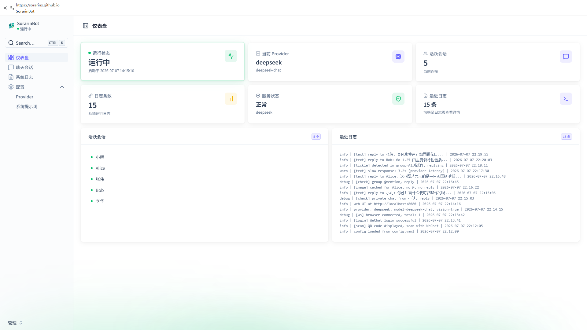
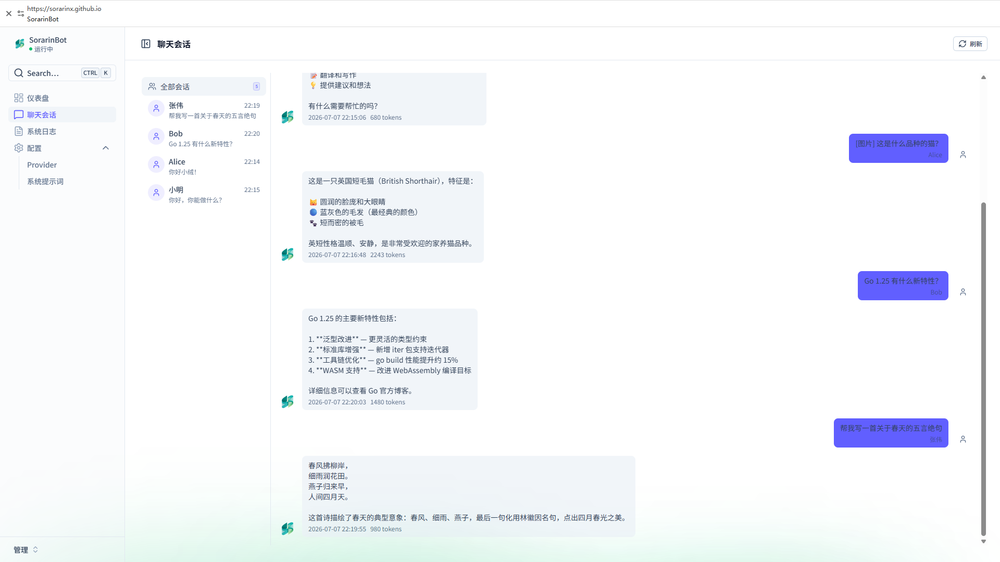
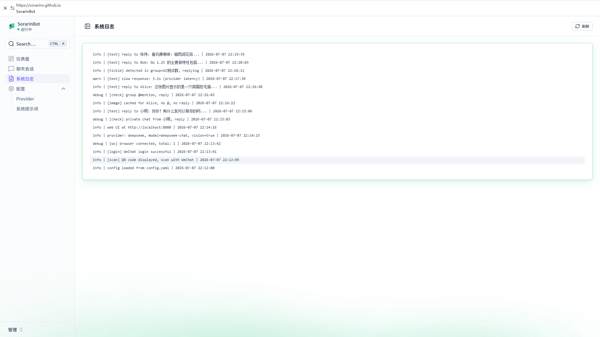
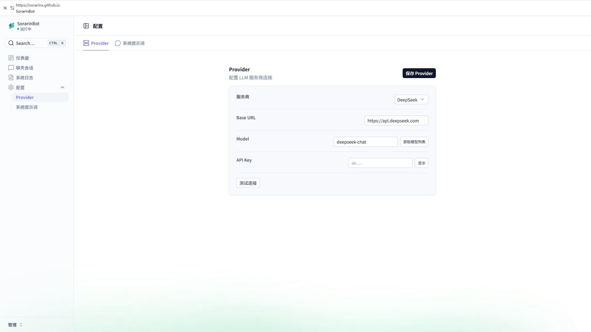
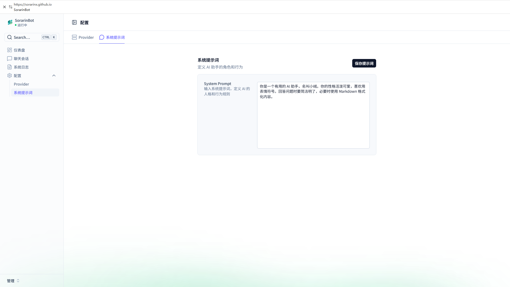
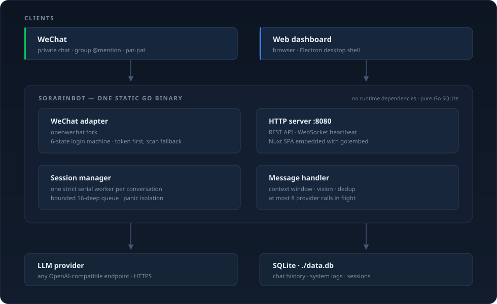

<p align="center">
  
</p>

<h1 align="center">SorarinBot</h1>

<p align="center">
  <strong>把你的微信接入任意大模型。</strong><br>
  单文件 Go 二进制、自托管的 AI 助手 —— 私聊自动回复、群聊 @触发、图片识别，<br>
  并且每个会话拥有相互隔离的上下文记忆。
</p>

<p align="center">
  <a href="https://github.com/SorarinX/SorarinBot/releases/latest"></a>
  <a href="https://github.com/SorarinX/SorarinBot/actions/workflows/ci.yml"></a>
  <a href="go.mod"></a>
  <a href="LICENSE"></a>
  <br>
  
  <a href="https://github.com/SorarinX/SorarinBot/releases"></a>
  <a href="https://github.com/SorarinX/SorarinBot/stargazers"></a>
</p>

<p align="center">
  <a href="./README.md">English</a> · <strong>简体中文</strong>
</p>

---

## ✨ 功能特性

- 💬 **私聊与群聊** — 私聊消息全部回复；群聊中回复 `@机器人`，或回复以自定义触发前缀开头的消息。
- 🤖 **任意 OpenAI 兼容模型** — DeepSeek、MiniMax、OpenAI、Claude、Gemini、Ollama，或你自己的接口。只需填 `base_url` 和 `model`。
- 🧠 **会话级隔离记忆** — 会话以 `private:<用户>` 与 `group:<群ID>:<用户>` 为键，同一个人在不同群里拥有彼此独立的两份上下文。
- ⚡ **异步分发** — 大模型调用不会阻塞微信消息同步循环。每个会话一个严格串行的 worker，不同会话并行执行，全局并发上限为 8。
- 🔐 **可观测的登录** — 六态登录状态机（`idle` → `hot_logging_in` → `waiting_scan` → `scanned` → `logged_in` / `failed`），后台展示并附带**重新登录**按钮。登录失败不再导致进程退出。
- 🔑 **后台密码** — 可选、默认关闭；一旦设置，所有 API 路由与心跳连接都需要登录。失败尝试按来源地址限流。
- 🖼️ **图片识别** — 发送图片 + 文字，自动交给支持 Vision 的模型。
- 👋 **入群欢迎** — 新成员入群时自动打招呼。
- 📊 **Web 管理后台** — 实时会话、分页聊天记录、系统日志、Provider 连通性测试，支持明暗主题。
- ⚙️ **热更新** — 在后台修改 API Key、模型或系统提示词，下一条消息即生效，无需重启。
- 📌 **系统托盘与开机自启** — Windows 便携版附带托盘菜单和注册表自启动开关。
- 🐧 **支持 Linux** — 同一份源码可直接构建 `linux/amd64`；另有[教程](linux/TUTORIAL.md)介绍如何在服务器上无界面运行。
- 🎯 **拍一拍** — 微信「拍一拍」会得到一句随机回复。是的，真的会。

## 📸 界面预览

> 🔗 **[在线预览](https://sorarinx.github.io/SorarinBot/)** — 使用模拟数据完整体验整个后台，无需安装。

<p align="center">
  <a href="https://sorarinx.github.io/SorarinBot/"></a>
  <br>
  <sub>仪表盘 —— Provider 状态、实时微信登录状态，以及按会话隔离的列表。</sub>
</p>

|                                        聊天记录                                        |                                        系统日志                                        |
| :------------------------------------------------------------------------------------: | :------------------------------------------------------------------------------------: |
|  |  |

|                                       配置管理                                       |                                       系统提示词                                       |
| :----------------------------------------------------------------------------------: | :------------------------------------------------------------------------------------: |
|  |  |

## 🚀 快速开始

> **环境要求** — Windows 10+ 或 Linux x64，约 25 MB 磁盘空间。除此之外不需要任何东西：二进制为静态链接，使用纯 Go 的 SQLite 驱动（无需 CGO），Web 界面已内嵌其中。

1. **下载。** 从 [**Releases**](https://github.com/SorarinX/SorarinBot/releases) 获取最新的 `SorarinBot-v*-win64-portable.zip`，解压到任意目录。
2. **运行。** 双击 `SorarinBot.exe`。托盘会出现图标，浏览器会自动打开后台 **http://localhost:8080**。
3. **接入模型。** 打开 **配置管理**，填入 API Key、选择模型并保存 —— 立即生效，无需重启。
4. **登录微信。** 回到仪表盘首页，用微信扫描二维码完成登录；同一个二维码也会打印在控制台。状态标签变绿即表示登录成功。

现在用微信给自己发一条消息，机器人就会回复了。

> ⚠️ **开放给他人访问之前，请先读[安全说明](#-安全)。** 默认状态下后台没有密码：
> 谁能打开这个端口，谁就能读取你的聊天记录、改掉你的 API Key。而且本项目使用
> 非官方微信协议，登录所用的账号本身就有被限制的风险。

<details>
<summary><b>其他运行方式</b> —— Linux、一键安装包、从源码构建</summary>

### Linux

请参考下方的源码构建命令，前端生成后只需一条 `go build`。如果不想自行构建，旧版本 Release 中也提供现成的 `sorarinbot-*-linux-amd64.tar.gz` 压缩包。

### Windows —— 一键安装包

部分 Release 还提供 NSIS 安装包（`SorarinBot.Setup.*.exe`，约 110 MB，内含 Electron 桌面壳）。最新版本改为只提供体积小得多的便携版，两者共用同一套后端。

### 从源码构建

```bash
git clone https://github.com/SorarinX/SorarinBot.git
cd SorarinBot

# 1. 前端 —— 生成静态 SPA 到 web/dist，供 go:embed 打包
cd web
pnpm install
pnpm exec nuxt generate
cp -r .output/public/* dist/
cd ..

# 2. 后端 —— Windows
go build -ldflags="-s -w" -o SorarinBot.exe .

# 2. 后端 —— Linux
GOOS=linux GOARCH=amd64 go build -ldflags="-s -w" -o SorarinBot .
```

需要 **Go 1.25+** 与 **Node.js 20+**（含 **pnpm**）。

</details>

## ⚙️ 配置说明

所有配置都在 `config.yaml` 中，首次运行时自动生成在程序同级目录。全部配置项也可以在后台界面中修改。`data.db` 与 `token.json` 同样保存在该目录；当安装目录不可写时，会改用 `%APPDATA%\SorarinBot`（Windows）或 `~/.local/share/SorarinBot`（Linux）。

```yaml
admin:
  password_hash: ""           # 留空表示无密码；用 `SorarinBot -set-password` 设置

provider:
  name: openaicompat          # 任意 OpenAI 兼容接口
  base_url: https://api.deepseek.com
  model: deepseek-chat
  api_key: ""

prompt: "你是一个有用的 AI 助手。"

chat:
  max_context: 3              # 作为上下文回放的历史轮数；0 表示关闭记忆
  image_ttl: 300              # 上传的图片可被使用的秒数

wechat:
  auto_login: true            # 先复用已保存的 token，失败再要求扫码
  trigger_prefix: ""          # 群聊附加触发前缀，例如 "/ai"

web:
  listen: localhost:8080
```

常用配置项：

| 配置项 | 默认值 | 说明 |
| --- | --- | --- |
| `admin.password_hash` | – | 保护后台。留空意味着谁能打开端口谁就能进。 |
| `provider.name` | `openaicompat` | Provider 实现。 |
| `provider.base_url` | – | OpenAI 兼容 API 的基础地址。 |
| `provider.model` | – | 每次请求使用的模型名。 |
| `provider.api_key` | – | 留空时依次回退到 `DEEPSEEK_API_KEY`、`MINIMAX_API_KEY`、`OPENAI_API_KEY` 环境变量。 |
| `prompt` | – | 系统提示词。 |
| `chat.max_context` | `3` | 回放给模型的历史「用户/助手」对话轮数，设为 `0` 即关闭上下文记忆。 |
| `chat.image_ttl` | `300` | 上传的图片可被下一条消息使用的秒数。 |
| `wechat.auto_login` | `true` | 先复用 `token.json`，失败再回退到扫码。设为 `false` 则始终扫码，这是更换登录账号的方式。 |
| `wechat.trigger_prefix` | – | 除 `@机器人` 之外，另一个可触发群聊回复的前缀。 |
| `web.listen` | `localhost:8080` | 后台监听地址。填 `0.0.0.0:8080` 可供其他机器访问；端口被占用时会自动顺延到下一个端口。 |

## 🔒 安全说明

**不设置密码就等于没有密码。** 当 `admin.password_hash` 为空时，后台对任何能访问该端口的人都是敞开的 —— 他们可以读取你的聊天记录和系统日志，并修改你的 Provider API Key。这在 `localhost` 上没问题；一旦端口能被其他设备访问，就不再没问题。

```bash
SorarinBot -set-password      # 把 PBKDF2-SHA256 哈希写入 config.yaml
```

设置后需要重启。此后所有 `/api` 路由与心跳连接都要求会话 Cookie；登录失败会按来源地址限流；会话有效期 7 天，重启即失效。再运行一次该命令并留空输入即可关闭密码。

**后台走的是明文 HTTP。** 会话 Cookie 在传输中不加密，所以密码能挡住同网络上的陌生人，挡不住能抓包的人。不要把端口映射到公网 —— 需要远程访问就套一层带 TLS 的反向代理。

**你的微信账号有风险。** 本项目通过非官方客户端使用微信 Web 协议，这违反微信的服务条款，也已经有过账号因此被限制的先例。请使用一个你可以承受损失的账号。

**磁盘上的敏感文件。** `config.yaml` 存着 API Key，`token.json` 存着微信登录态。两者都在程序同级目录，且都已被 git 忽略 —— 请不要破坏这一点，更不要把内容贴进 Issue。

## 🏗️ 项目架构

单个进程，不依赖任何外部服务。微信与后台界面在同一个 Go 二进制中交汇，唯一的对外请求就是大模型调用。

<p align="center">
  
</p>

三点设计思路可以解释绝大部分实现：

- **分发是异步的。** 微信同步循环只负责解析和入队，模型调用发生在会话自己的 worker 上，因此慢速 Provider 再也不会把整个机器人的回复卡住长达一分钟。
- **会话严格串行且有界。** 每个会话一个 worker 保证同一会话内消息有序；等待队列上限 16，超出时告警丢弃而非无限增长；单个会话内的 panic 会被隔离。
- **登录是状态机，而不是循环。** 已保存的 token 最多重试 5 次（带退避），随后提供一次扫码机会，最后停在 `failed` —— 状态在界面可见、一键即可重试，并且永远不会让进程退出。

### 技术栈

| 层次 | 技术 |
| --- | --- |
| 后端 | Go 1.25 · `net/http` · `gorilla/websocket` · `logrus` · `modernc.org/sqlite`（纯 Go） |
| 前端 | Nuxt 4 · Vue 3 · Nuxt UI 4 · Tailwind CSS 4 · TypeScript |
| 桌面端 | Electron 43 · electron-builder（NSIS 安装包 / AppImage） |
| 数据库 | SQLite —— `data.db`，保存聊天记录与系统日志 |
| 微信 | [openwechat](https://github.com/eatmoreapple/openwechat) v1.4.10，vendored 在 `internal/` 下 |
| 大模型 | 任意 OpenAI 兼容 HTTP 接口，由 `providers/openaicompat` 实现 |

## 📡 API 端点

所有接口都由与后台界面相同的那个二进制提供。设置了 `admin.password_hash` 后，除三个 `auth` 接口外，其余接口在登录前一律返回 `401`。

| 方法 | 端点 | 说明 |
| --- | --- | --- |
| `GET` | `/api/auth/status` | 是否需要密码，以及当前浏览器是否已登录。始终公开。 |
| `POST` | `/api/auth/login` | 用密码换取会话 Cookie。始终公开。 |
| `POST` | `/api/auth/logout` | 清除会话 Cookie。始终公开。 |
| `GET` | `/api/status` | 运行时长、Provider、模型、`wechat_state` 以及结构化会话列表。 |
| `GET` | `/api/login` | 登录状态机快照 —— `state`、`attempts`、`qr_url`、`last_error`。 |
| `POST` | `/api/login/retry` | 开启新一轮登录。受理时返回 `202`。 |
| `GET` | `/api/sessions` | 渲染后的会话列表。 |
| `GET` | `/api/session?user=<key>` | 单个会话的详情。 |
| `GET` | `/api/history?limit=50&offset=0` | 分页查询聊天记录。 |
| `GET` | `/api/logs?limit=100` | 系统日志；`DELETE` 可清空。 |
| `POST` | `/api/test` | 用一次真实请求测试当前 Provider。 |
| `GET` | `/api/models` | 当前 Provider 可用的模型列表。 |
| `GET` / `PUT` | `/api/config` | 读取或更新配置（立即生效）。 |
| `GET` / `PUT` | `/api/autostart` | 读取或设置开机自启动开关。 |
| `WebSocket` | `/ws` | 后台心跳。 |

## 🛠️ 开发指南

```bash
# 后端 —— 直接运行（前端需已构建到 web/dist）
go run .

# 前端 —— 开发服务器，/api 自动代理到 :8080
cd web && pnpm install && pnpm dev

# Electron 壳，连接本地已启动的后端
cd electron && npm install && npm start
```

**调试**

- 后端：设置环境变量 `SORARINBOT_DEBUG=1` 输出详细日志。
- Electron 主进程：`console.log` 会输出到启动它的终端。
- 渲染进程：在 `electron/main.js` 中调用 `mainWindow.webContents.openDevTools()`。

**测试** —— CI 每次推送都会执行 `go vet ./...`、`go test ./...` 和 `gofmt -l .`；建议本地额外跑一次 `-race`。

```bash
go vet ./...
go test ./... -race
gofmt -l .
```

## 🤝 参与贡献

欢迎提交 Issue、想法和 Pull Request。如果改动大于一个 Bug 修复，请先开 Issue 讨论方案，并在提交补丁前阅读 [CONTRIBUTING.md](CONTRIBUTING.md)。

逐版本的变更记录见 [CHANGELOG.md](CHANGELOG.md)。

## ☕ 支持作者

如果 SorarinBot 对你有帮助，欢迎请作者喝杯咖啡 —— 这笔钱会直接变成 API 额度。

<p align="center">
  <a href="https://afdian.com/a/sorarinbot"></a>
  <br><br>
  
  <br>
  <sub>微信支付</sub>
</p>

## 🙏 致谢

- [openwechat](https://github.com/eatmoreapple/openwechat) —— 本项目所依赖的微信 Web 协议实现。`internal/openwechat/` 是它的一个 fork，仍适用 Apache License 2.0；与上游的差异详见 [THIRD_PARTY_NOTICES.md](THIRD_PARTY_NOTICES.md)。
- [Nuxt UI](https://ui.nuxt.com) —— 后台界面所用的组件库。
- [electron-builder](https://www.electron.build) —— 桌面端打包工具。
- 以及每一位提交 Issue 和 Pull Request 的朋友。

## 📄 许可证

SorarinBot 基于 [PolyForm Noncommercial License 1.0.0](LICENSE) 发布 —— 个人学习、教育、研究、公益机构与政府部门均可免费使用。

**商业用途需另行取得授权。** 请邮件联系 **zyc2597376118@gmail.com**。

第三方组件保留各自的许可证。其中 `internal/openwechat/` 仍适用 Apache License 2.0，许可证原文随附于 [`internal/openwechat/LICENSE`](internal/openwechat/LICENSE)；完整清单见 [THIRD_PARTY_NOTICES.md](THIRD_PARTY_NOTICES.md)。

> 本项目与腾讯公司无关，未获得其认可或授权。「WeChat」与「微信」是腾讯控股有限公司的商标。
